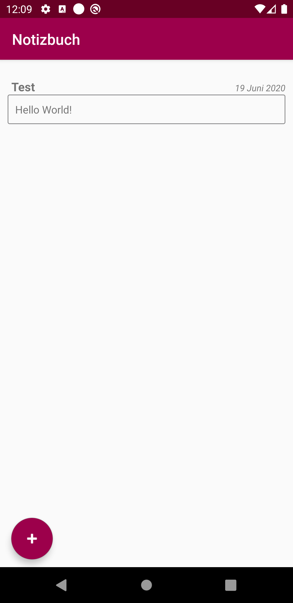
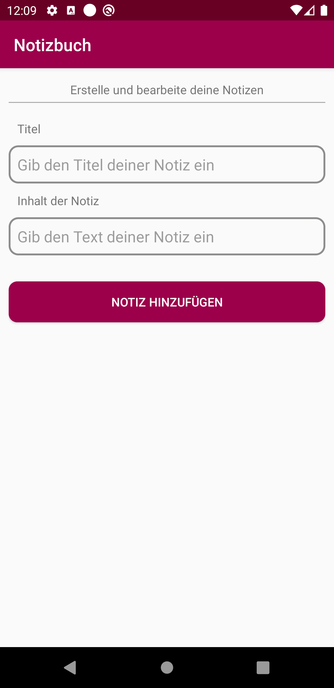
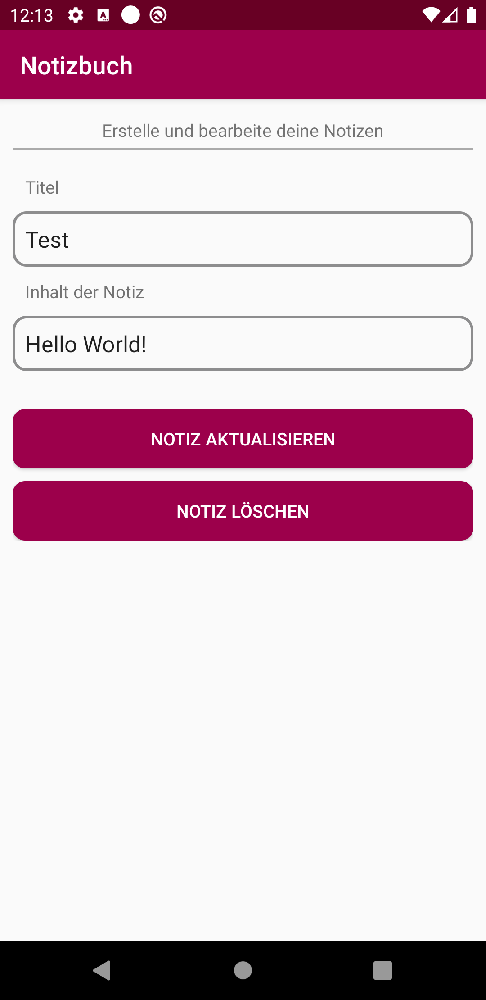
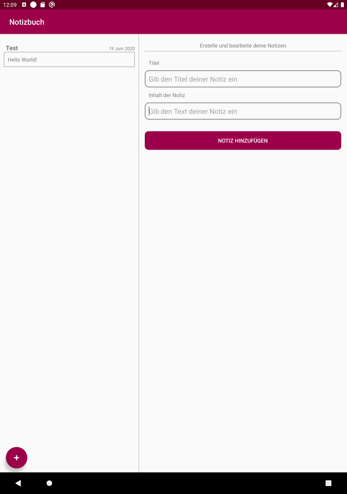

# U11 | Notizbuch

## Aufgabe

Das Ziel dieser Aufgabe ist die Implementierung einer App zur Erstellung und Anzeige von Notizen. Die Anwendung soll dabei so umgesetzt werden, dass sie auf Geräten mit hoher Displaybreite, wie zum Beispiel einem Tablet, ebenfalls gut funktioniert, indem die Notizliste und die Eingabemaske, je nach Auflösung, zusammen oder getrennt voneinander angezeigt werden. Die erstellten Notizen werden in einer lokalen Datenbank hinterlegt.

## Hinweise

* Für die Umsetzung der dynamischen Anzeige werden Fragments verwendet, die Sie aus früheren Vorlesungen kennen. Ein Fragment ist für die Auflistung der Notizen zuständig, das andere stellt die Eingabeoberfläche für Notizen dar
  * `Fragments`: https://developer.android.com/guide/components/fragments
* Die erstellten Notizen müssen zwischen den beiden Activities übertragen werden. Damit dies über den Intent funktioniert, implementiert die `Note`-Klasse das `Parcelable`-Interface. Verwenden Sie die `startActivityForResult(...)`-Methode in Kombination mit `onActivityResult(...)` um einen Rückkanal zwischen Ihren Activities zu schaffen und die `finish()`-Methode um Ihren Activity `Back Stack` möglichst klein zu halten
  * `Parcelable`: https://developer.android.com/reference/android/os/Parcelable
  * `Activity Stack`: https://developer.android.com/guide/components/activities/tasks-and-back-stack
* Erstellen Sie sich über den AVD-Manager ein passendes Tablet (z.B. Pixel C) um Ihre App, zusätzlich zum regulären Smartphone, auf einem größeren Bildschirm zu testen

## Ausgangslage
* Die für die Aufgabe benötigten Layouts der Activities und Fragments sind bereits vollständig implementiert
* Die lokale Datenbank liegt in Form einer `RoomDatabase` vor. Über den `NoteDatabaseHelper` und das zugehörige `NoteQueryResultListener`-Interface können Sie Notizen abfragen, erstellen, aktualisieren und löschen
* Notwendige Konstanten finden Sie in der `AppConfig`-Klasse
* Alle benötigten Klassen sind bereits erstellt. Die Auflistung der Notizen durch das `NoteListFragment` funktioniert bereits. Ihre Aufgabe ist es, sich um die Eingabemaske zu kümmern. Diese soll bei einem regulären Smartphone in einer eigenen Activity angezeigt werden, bei einem Tablet steht sie dagegen neben der Notizliste. Die zugehörigen Klassen sind das `ContentFragment` und die `ContentActivity`.

## Vorgehen
### Wechsel zwischen Activites
Beginnen Sie damit, den `FloatingActionButton` in Ihrer `MainActivity` mit Funktionalität zu belegen. Wenn dieser betätigt wird, wollen Sie bei einem Smartphone in die `ContentActivity` übergehen. Dort soll später ein neues Objekt der Klasse `Note` erzeugt und wieder zurück an die `MainActivity` gegeben werden. Damit das funktioniert, ohne dass Sie über Kreuz mit `startActivity` immer wieder neue Activites auf Ihren Stack stapeln, um über Intents Daten zu übertragen, sollten Sie stattdessen die im Hinweis erwähnte Methode verwenden.

### Fragments und Acivities verbinden
Speichern Sie an den passenden Stellen eine Instanz Ihres `ContentFragments`. Mit Hilfe dieser Instanz können Sie aus Activities heraus auf Methoden des Fragments zugreifen. Anders herum sollte das `Fragment` ein Interface verwenden um mit der Activity zu kommunizieren. Dieses ist bereits erstellt, sie müssen Ihre Activities lediglich als Listener registrieren. Sie können sich dafür an der Implementierung des `NoteListFragments` orientieren.

### ContentFragment
Vervollständigen Sie die `ContentFragment`-Klasse, indem Sie zunächst Ihre Layout-Bausteine referenzieren. Belegen Sie die Buttons mit OnClickListenern und passenden Callback-Methoden. Die TextViews Ihres Fragments können Sie verwenden, um eine neue Note zu erstellen (den Zeitstempel müssen Sie selbst generieren). Diese neue Notiz sollen Sie über die Methoden des `OnInputSubmitListener`-Interfaces an die jeweiligen Observer übergeben.

### Notiz verarbeiten
Sobald Ihre `ContentActivity` ein `Note`-Objekt über die Callback-Methoden erhalten hat, ist die Eingabe abgeschlossen und die Activity kann entsprechend beendet werden. Nutzen Sie die `setResult`-Methode und übergeben Sie dieser einen Intent den Sie mit der Notiz befüllen, bevor Sie die Activity beenden. Geben Sie außerdem einen Schlüssel an, durch den die MainActivity ermitteln kann, was mit der Notiz passieren soll (add, update, delete). Die entsprechenden Werte finden Sie in der `AppConfig`-Klasse. In der `MainActivity` können Sie die `onActivityResult`-Methode überschreiben um die Notiz und den Schlüssel auszulesen. Je nach Schlüssel wird diese dann zum Beispiel an das `NoteListFragment` weiter gegeben und in der Datenbank abgelegt

### Notiz aus der Liste auswählen
Nachdem an dieser Stelle Notiz-Elemente hinzugefügt werden können, soll auch mit diesen interagiert werden. Die `onListItemSelected`-Methode übergibt das Notiz-Objekt, das hinter der angeklickten Position steckt. Dieses soll in das `ContentFragment` geladen werden, damit Inhalt und Titel angepasst und überschrieben oder die Notiz gelöscht werden kann. Nutzen Sie für den Austausch zwischen `MainActivity` und `ContentActivity` wieder einen Rückkanal, geben Sie hier allerdings das angeklickte Notiz-Objekt mit. Im `ContentFragment` können Sie dann, wenn bereits eine Notiz vorhanden ist, diese bearbeiten oder löschen, statt ein neues Objekt zu erzeugen. Passen Sie die Schriftzüge der Buttons entsprechend an, um den Dialog klarer zu gestaltet. Sie können auch Buttons ausblenden, falls diese nicht notwendig sind.

### Zusammensetzen des MainActivity Layouts
Bei großen Displays soll das `ContentFragment` in der MainActivity angezeigt und bedient werden können. Das funktioniert analog zur bisherigen Lösung, nur arbeitet die MainActivity dann direkt mit einer Instanz des `ContentFragments`, anstatt den Umweg über die `ContentActivity` zu gehen. Dadurch dass Sie für beide das `OnSubmitInputListener`-Interface verwenden können, haben Sie den Großteil bereits gelöst. Sie müssen nur, je nachdem ob Ihre MainActivity aktuell ein `ContentFragment` hat, entscheiden mit welcher Klasse sie kommunizieren müssen.

**Hinweis:** Die bezogene Instanz des Fragments ist `null`, wenn das Fragment in der Activity gerade nicht existiert. Das ist immer dann der Fall, wenn z.B. eine Bedingung, wie in diesem Fall eine Mindestdisplaybreite von 600dp, nicht gegeben ist. Darum das richtige Layout zu wählen, kümmert sich das Android System. Diesen `null` Vergleich können Sie nutzen, um zu überprüfen, mit welcher Art von Display Sie gerade arbeiten

## Anhang
### Screenshots

| | | | | |
|-|-|-|-|-|
|{ height=8cm } |{ height=8cm } |{ height=8cm } |{ height=8cm } |{ height=8cm } |

