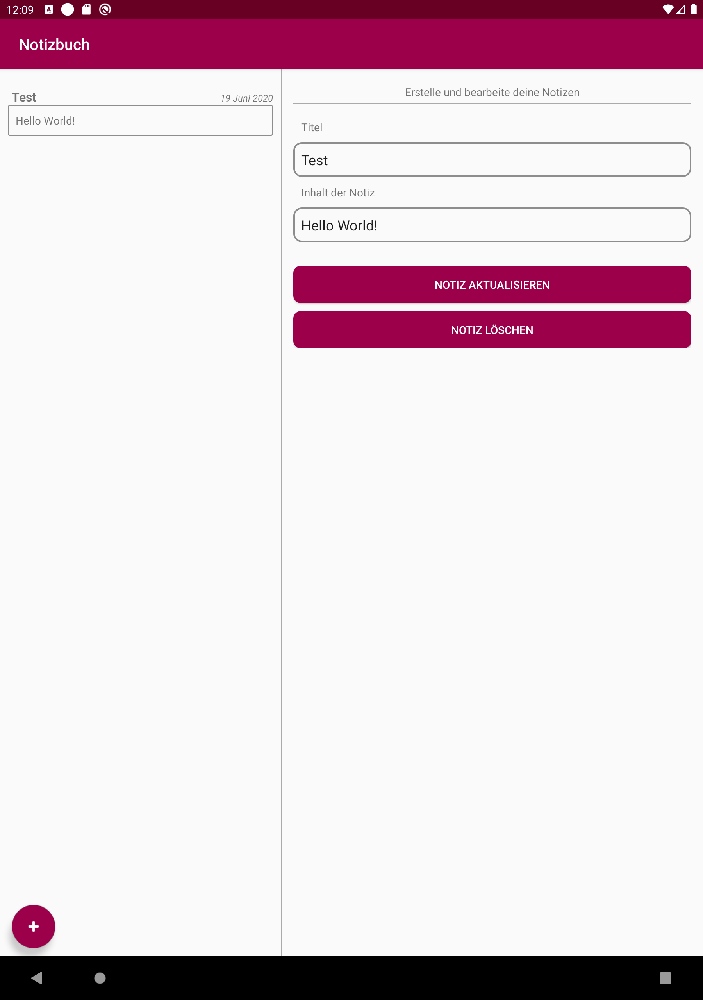

# U11 | Notizbuch

## Downloads

- [Download des Starterpakets](https://github.com/Android-Regensburg/U11-Notizbuch/archive/master.zip)
- [Download des Lösungsvorschlag](https://github.com/Android-Regensburg/U11-Notizbuch/archive/solution.zip)

## Aufgabe

Implementieren Sie im Rahmen dieser Übung eine Anwendung, die als virtuelles Notizbuch dienen soll. Kern dieser Aufgabe ist es, mit der Vielfalt verschiedener Bildschirmeigenschaften umzugehen. Das UI ihres Notizbuches soll sich daher an die Displaybreite des Gerätes anpassen, das heißt die Kernelemente entweder in einer Zeile oder untereinander anzeigen.
Nach Erstellung oder Aktualisierung einer Erinnerung soll eine Benachrichtigung ausgegeben werden, die nicht auf dem Sperrbildschirm angezeigt werden soll.

## Hinweise

* Erstellen Sie das Interface aus einer Liste der bisher angelegten Notizen und einer Ansicht zum Erstellen von Notizen.

* Die Sichtbarkeit von Benachrichtigungen kann seit Android 5.0 mit `public Notification.Builder setVisibility (int visibility)` festgelegt werden. Als Parameter werden dabei VISIBILITY_PRIVATE, VISIBILITY_SECRET oder VISIBILITY_PUBLIC entgegen genommen.

* Die Datenbank zur Speicherung der Notizen ist bereits implementiert und kann unverändert übernommen werden.

* Über XML eingebundene Fragments können zur Laufzeit nicht programmatisch entfernt oder ausgetauscht werden. Eine Alternative wäre es diese programmatisch Einzufügen, allerdings soll dies vermieden werden, um die Trennung von View und Model beizubehalten. Als Lösung bietet sich das Einhüllen eines Fragments in einer eigenen Activity an. Im "breiten" Layout werden dann beide Fragments in eine Activity eingebunden, im schmalen sind diese auf zwei Activities aufgeteilt.

* Mithilfe des <include/>-Tags können andere Layout-Dateien eingebunden werden. Die Attribute sind layout (dahinter ein Verweis auf die einzubindende Datei, z.B. @layout/content_main sowie die Höhe und Breite (android:layout_width und android:layout_height). Auch eine id kann vergeben werden.

* Android Studio erlaubt es unterschiedliche Ressourcen-Dateien für verschiedene Fälle bereit zu stellen. Beim Anlegen selbiger ist mittels der Liste „availiable qualifiers“ die Auswahl eines oder mehrerer Qualifier und danach die Angabe von Werten möglich. Diese spezifizieren genauer, für welche Geräte bzw. Betriebssystemversion die Ressourcendatei gedacht ist. Daraufhin wird die neue Datei automatisch in dem passenden Ordner erstellt. Beispiel: Layout-Dateien, die ab einer Bildschirmbreite über 600dp verwendet werden sollten, werden im Order layout-w600dp abgespeichert.

## Vorgehen

### Anpassungen in den Activities

#### Einstiegspunkt in die App

Die App kann entweder aus dem Launcher heraus oder über eine Benachrichtigung aufgerufen werden. Diese beiden Fälle müssen beim Start der App unterschieden werden, damit im Falle der Notification die zugehörige Notiz direkt angezeigt werden kann.

1. Hierzu muss in der onCreate()-Methode der Activity der startende Intent abgerufen werden. Wurde die App aus einer Benachrichtigung heraus gestartet, trägt der verantwortliche Intent ein spezielles Extra mit sich. Über dieses Extra wird die Zusammengehörigkeit der Benachrichtigung und der App hergestellt. Existiert also ein Extra mit dem Schlüssel, der in INTENT_ITEM_SELECTED_NAME hinterlegt ist und dem Wert, der in INTENT_ITEM_SELECTED_ID liegt, so wurde die App aus einer ihrer eigenen Benachrichtigungen heraus aufgerufen.

2. Die ID der anzuzeigenden Notiz (Wert) liegt als weiteres Extra vor, dessen Schlüssel ARG_ID aus der Klasse ContentFragment entspricht.

3. Um direkt in die Detailansicht zu springen und die ermittelte Notiz anzuzeigen, kann der OnListItemSelected-Listener der Notizliste explizit aufgerufen werden (und nicht wie sonst als Callback fungieren).

#### Auf eine Listenauswahl reagieren

Der OnListItemSelected-Listener ist eigentlich zum Abfangen von Nutzerinteraktionen da und wird auf der Notizliste angemeldet. Hierzu wurde die Activity mittels implements-Statement als Listener definiert. Infolgedessen ist die Callback-Methode onListItemSelected() in der Activity zu implementieren. Dafür ist zunächst zu prüfen, welche Layoutvariante auf dem Gerät geladen ist:

a. Handelt es sich um ein „breites“ Gerät (mind. 600dp Breite), so werden die Notizliste und Detailansicht gleichzeitig nebeneinander angezeigt. Diese Tatsache können Sie dazu nutzen, mithilfe des FragmentManagers festzustellen, ob das entsprechende ContentFragment bereits geladen ist. Ist es geladen, kann die ausgewählte Notiz mittels der Methode viewContent() in ebenjenem Fragment sogleich angezeigt werden.

b. Handelt es sich um das schmale, „ein-Fragment“ Layout, muss zu der Activity gewechselt werden, welche Notizen anzeigt. Diese ist eigenständig, enthält jedoch auch ein ContentFragment. Damit dieses Fragment die Notiz anzeigen kann, muss zuerst seine Elternactivity (ContentActivity) gestartet werden. Hierzu wird ein Intent erzeugt, der ContentActivity startet. Als Extra wird unter Zuhilfenahme des Schlüssels ContentFragment.ARG_ID die ID der Notiz mitgegeben.

####  Notizen in der ContentActivity anzeigen

* In onCreate() ist zuerst der Intent auszulesen und zu unterscheiden, ob eine bestehende Notiz angezeigt oder eine neue angelegt werden soll. Hierzu kann das zuvor eingeführte Extra mit dem Schlüssel ARG_ID verwendet werden. Ist es vorhanden und der Wert nicht gleich -1 (Dummy-Wert für „neue Notiz anlegen“), wird die so übergebene ID benutzt, um mittels viewContent() des ContentFragments die entsprechende Notiz zu laden. Andernfalls wird ein leeres Formular zum Anlegen einer neuen Notiz angezeigt (via loadEmptyView())

### Anpassungen in den Fragments

Im ContentFragment ist ebenfalls zu unterscheiden, welche Darstellung auf dem Gerät geladen ist, da hiervon Abläufe innerhalb des Fragments betroffen sind.

1. Im ContentFragment ist in der Methode removeEntry() im Falle des schmalen Layouts (mit nur einem sichtbaren Fragment) zur Liste mit den Notizen zurückzuschalten. Die Liste ist als eigenes Fragment (MyListFragment) in der MainActivity eingebettet. Der FragmentManager hilft wiederum bei der Feststellung des Layouts. Gestartet wird die MainActivity dann mit dem Extra INTENT_ITEM_SELECTED_NAME (Selbstaufruf, nicht aus einer Benachrichtigung heraus; s.o.).

2. Ebenfalls im ContentFragment ist in der Methode createNotification() die Sichtbarkeit der Benachrichtigung auf dem Sperrbildschirm zu verhindern (setVisibility(), s.o.). Dies ist aber erst ab Android 5.0 („Lollipop“) möglich. Im Falle einer älteren Android-Version kann diese Option nicht gewählt werden. Eine Fallunterscheidung abhängig von der installierten Version des Betriebssystems verhindert an dieser Stelle den Absturz der App.

Die restliche Funktionalität ist bereits vorgegeben. Nach ein paar wenigen Anpassungen am Layout ist
die Aufgabe fertig.

### Anpassungen in den Layout-Dateien

Je nachdem, ob die App auf einem breiten oder schmalen Gerät ausgeführt wird, unterscheiden sich Funktionalität (bzw. Nutzerführung) und Layout. Entweder werden das Listen- und das Notizfragment gleichzeitig und nebeneinander angezeigt, oder einzeln und bildschirm-füllend. Unabhängig davon, ob eine Notiz auf einem schmalen oder breiten Bildschirm angezeigt wird, wird jedoch in beiden Fällen das ContentFragment mit dem gleichen Layout verwendet. Es ist deshalb sinnvoll, auch nur eine maßgebliche Layoutdatei für dieses Fragment zu definieren (in diesem isolierten Beispiel werden zur Vereinfachung keine weiteren Anpassungen an die Displaygröße vorgenommen). Dieses soll dann, je nach Gerät, geladen oder ignoriert werden. Da Android Ressourcendateien nach Bedarf auf Basis der verwendeten Qualifier lädt, können die unterschiedlichen Varianten einfach in entsprechenden Layouts definiert werden. Welches zur Notizbuch Laufzeit geladen wird, entscheidet das System auf Basis der vergebenen Qualifier für diese Ressourcendateien.

1. Da der einzige Unterschied zwischen den beiden Varianten die Anzeige des ContentFragment ist, wird ein Layout activity_main.xml für die MainActivity angelegt. In diesem befinden sich Angaben zum Theme und es wird ein FloatingActionButton zu Erstellung einer neuen Notiz definiert. Daneben wird mithilfe des <include />-Elements ein anderes Layout referenziert. Diesen Mechanismus nutzen wir zum Stellen der Weiche zwischen „schmalen“ und „breiten“ Geräten.

2. Für das mittels <include /> eingebundene Layout content_main werden zwei verschiedene Dateien erstellt: Eine Layoutressource mit dem Namen content_main.xml, welche den Qualifier für eine Bildschirmmindestbreite von 600dp angibt (w600dp) und eine gleichnamige Datei ohne diese Auszeichnung. Bei der Erstellung der Datei via AndroidStudio kann dieser Qualifier ausgewählt werden. Wurzelelement derartiger Dateien ist ein Layoutelement (z.B. RelativeLayout).

3. Entsprechend der Vorgabe enthält die Layoutdatei für breite Geräte (w600dp) zwei Fragmente:

    a. Die Liste als <fragment android:name=“...MyListFragment“ .../>

    b. ... und die Notizansicht als <fragment android:name=“...ContentFragment“ .../>

4. Das Layout content_main ohne Einschränkung, das nur geladen wird, wenn das Gerät nicht die Eigenschaft w600dp erfüllt, enthält entsprechend nur das erste Listenfragment.

## Anhang
### Screenshots

